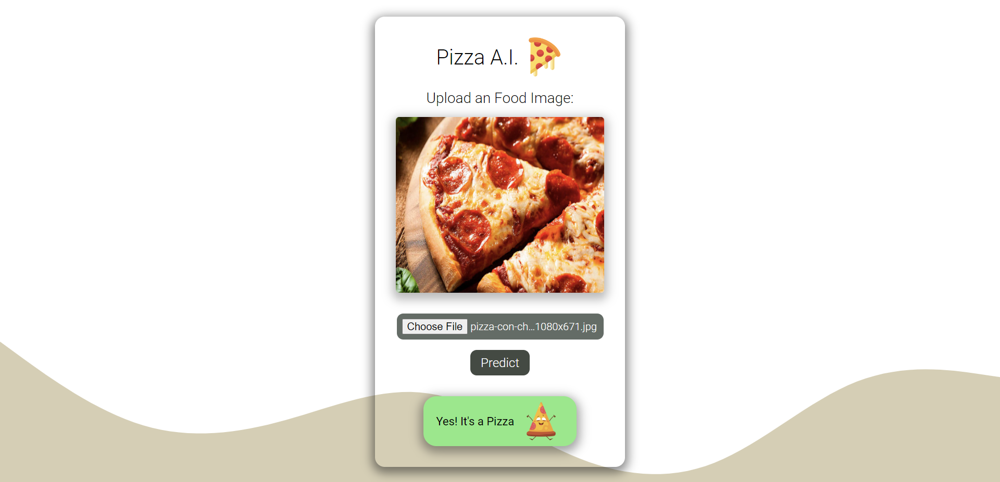
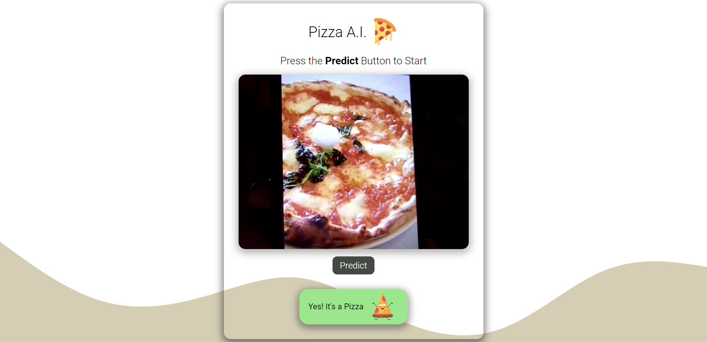

# Binary Pizza Classification
## Binary Tensorflow Model Using Convolutional Neural Network
### You can test it with your Webcam or also just uploading the image
- It was trained using the following Kaggle [dataset](https://www.kaggle.com/datasets/carlosrunner/pizza-not-pizza)
- The model has between 70% - 80% accuracy
### This Model was builded using the following technologies:
> 📌 `Tensorflow` and `Keras API`
> 📌 Convolutional Neural Network

The model was exported using `TensorflowJS` so it can be proved using HTML-CSS-JS 

### Test the Model with just uploading an image

### Test the Model with using your Webcam
 

